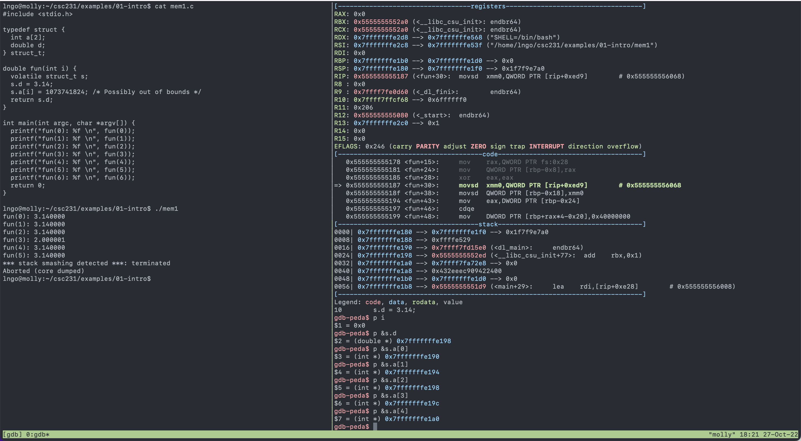

# Lab 2: GDB

## Student Name: Brian Giovinazzo

## Overview:

- In the [Memory-referencing bug](https://www.cs.wcupa.edu/lngo/courses/csc231/lectures/01-introduction.html#hands-on-memory-referencing-bug) section of the Introduction lecture, we observed how *index-out-of-bound* error in C can lead to either incorrect result, correct result, and a stack-smashing warning. This is shown in the Figure below:
  - The left tmux panel shows the source code of `mem1.c` and the outcomes of the runs. 
  - The right tmux panel shows the address of `s.d`, and the subsequent addresses of indices in array `s.a` up to 4, even though array `s.a` is only declared with two array elements.
  - The address of `s.a[2]` is the same as the address of `s.d`. 
  - The address of `s.a[3]` is 4 bytes higher than the address of `s.a[2]`, but is still within the range of `s.d`'s 8-byte allocation. 

## Instructions:

- Make sure that you are able to complete all the hands-on activities in the `GDB Debugger` page.
- For this lab, you are to do the followings:
  - Compile `mem1.c` with gdb option enabled. 
  - Run `mem1` inside gdb and set breakpoint to function `fun` using function name. 
    - Take a screenshot showing the correct breakpoint set up (screenshot 1).
  - After run the statement to assign 3.14 to `s.d`, you can check the binary value of `s.d` by running `x /t &s.d`
    - Take a screenshot showing the gdb command and the resulting value (screenshot 2). 
    - This is floating point representation for 3.14. 
    - Question 1: Identify S, E, and M of `s.d`. 
  - Continue running until you are executing function `fun` on `fun(3)`. 
    - Print out the binary value of `s.d` prior to the array assignment. 
    - Take a screenshot showing the gdb command and the resulting value (screenshot 3).
    - After the array assignment happens, print out:
      -  the binary value of `s.d`
      -  the floating point value of `s.d` by running `x /f &s.d`
      -  the decimal value of `s.a[3]`
      -  the binary value of `s.a[3]`. 
      -  Take a screenshot showing the gdb command and the above values (screenshot 4).
      -  Question 2: Identify the new S, E, and M of `s.d`.
    - In the lab report, present the binary value of `s.d` before and after the assignment of `s.a[3]`, 
    and use the binary value/address of `s.a[3]` to demonstrate which segment of `s.d` was modified in memory. 

## Submission requirements

- Adjust your terminal windows so that it can display as much components of gdb-peda as possible. 
  - At a minimum, the C instructions to be executed next, gdb instructions, and any values as specified by the lab
  requirements above should clearly displayed in the screenshots. 
- All screenshots (4 in total) and answers to question (2 questions in total) should be placed on a **single PDF document** in the correct cronological order of the lab instructions. 
- The **single PDF document**added to your lab Github repository. 

